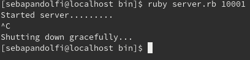
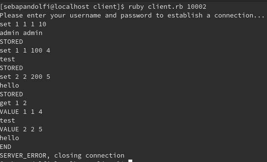
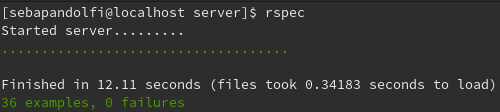
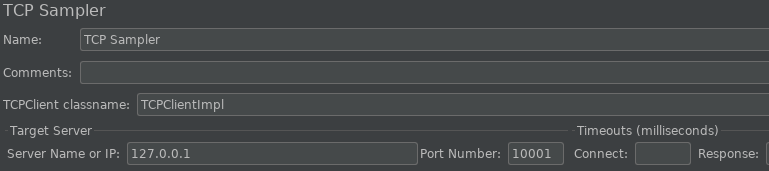
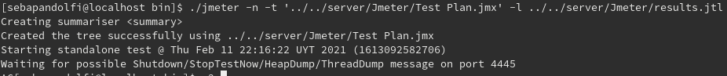
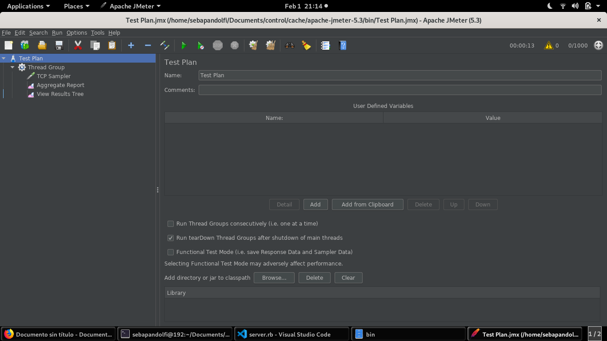
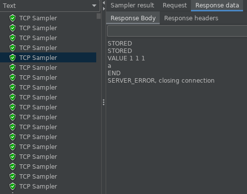
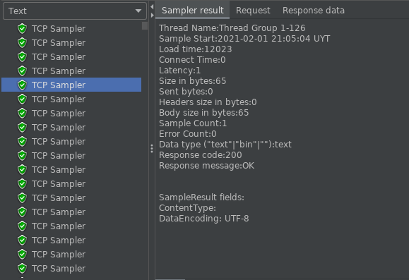
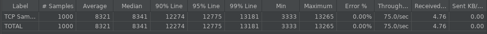

# Memcache
## Run the server
First of all, we need to get the server/bin running. For it, in the folder server we execute

`ruby server.rb {port we wish to use}`

As we can see in the next image.
  
To shutdown the server correctly we can do it with ctrl + c or ctrl + z.

## Run the client
The client only works, if it is run in the same machine that the server. That is because it is
configured to use the interface 127.0.0.1 that is local to the machine. We can simply solve
this changing the next line.

Instead of using 127.0.0.1, we configure the IP address where the server is running.  
To run the client, in the folder client we execute 

`ruby client.rb {same port we use previously}`  

Once it’s running the first message must be of authentication. For this we send a fake set
message and after that the user and password.
After this we can start sending requests. This must be done following the structure defined
in the protocol's documentation.
The next image is a sample of this exchanging message.

### Users
Authorized users are in Users/users.txt file. The first row is user and the second row is password.

## Running tests

### Unit tests
The files for the unit test are in the folder server/spec. To run the unit tests in the folder server we execute

`rspec`  

If everything is correct, after a short delay because of the expiration time tests, the test's finish with 36 correct examples.  
 

### Load test
The file for the load test is Test Plan.jmx, in the folder server/Jmeter. Remember that
the server must be running for requests to be answered. And the IP address and port in the
tcp sampler must be correctly configured. In this case, it is using the loopback address and
the port 10001. The server must be running using the same port.  
 
This file run’s 1000 sample client’s in 10 seconds, every client sends 1 message of
authentication, 1 message of set and 1 message of get.
To run this file we have 2 options, in the graphical interface or from the terminal.
From the terminal, in the folder apache-jmeter-5.3/bin we execute  

`./jmeter -n -t '../../server/Jmeter/Test Plan.jmx' -l ../../server/Jmeter/results.jtl`  

To end the test we need to kill the server with ctrl + c or ctrl + z. The results of this test are
saved in server/Jmeter under the name of results.jtl.  
 
The graphical interface is open in the folder apache-jmeter-5.3/bin with the command  

`./jmeter`

Once in there we open the file of Test Plan.jmx and we press play with the green arrow.
 
Then it starts running. In the upper right corner it shows the seconds elapsed since the start
and the number of tcp sampler executed from the total. Once it reaches the total of 1000, we
need to kill the server.
The listeners show the result.
 
 
 
 
As we can see all the clients receive the correct response, the time dont give much
information because it depends on the moment we kill the server.
The important information is that it can answer 100 clients per second without problems.

